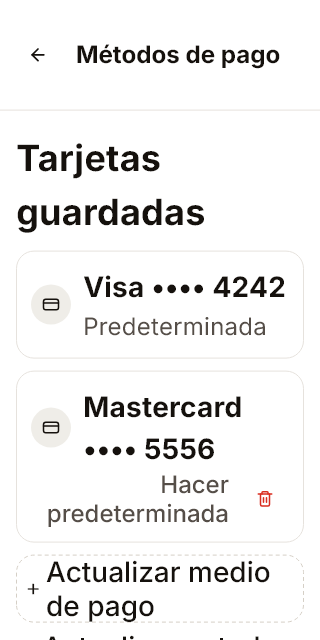
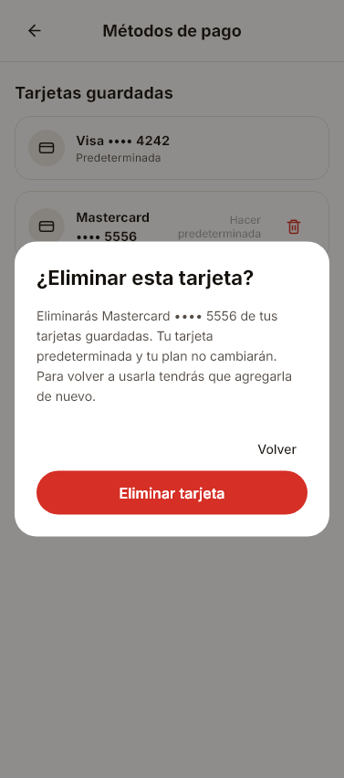
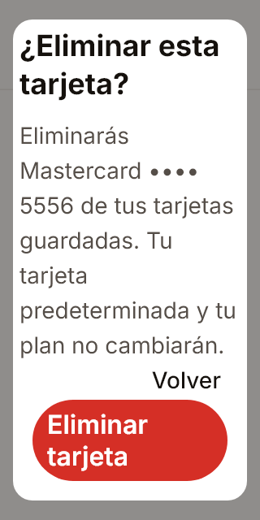

# Métodos de pago: eliminación, loop364 — 3/10/2026

Referencia Irlanda `a3c969cd9103fd46dc5cd886999912526ce75efb` reconsultada. Capturas Flutter reales con repositorios sintéticos, no teléfono ni aceptación de Irlanda. Source `PaymentMethods` aporta trash18/danger#d92d20/p14/r18 y enlace12/muted#554e48; SVG copiado íntegro. Acción sólo en tarjeta no predeterminada; blanco, confirmación24/colores de cancelación Guardian y entrada inmediata. Confirmación real necesaria para detach, no toast simulado.

42 pruebas dirigidas9s(handle74555exit0), analyze limpio31.5s(handle25982). PayloadHTTP4/4 adicional con IDs sintéticos de forma válida: remove_method sólo con targetlocal; recuperación sin ID usa method y el servidor conserva su target. Reintento mismo key/revision/consentimiento; no carddefault borrable ni desaparición optimista, rechazoin_use se muestra sin éxito, no Checkout nuevo. El contenido largo de confirmación se desplaza; controles siguen accesibles. Capturador4 estados3s(handle2976exit0). Inventario314 estados/37URLs, no314pantallas aceptadas.

Pendientes: eliminaciónStripe real aislada/Auth integrada; Agregar tarjeta independiente, billeteras reales, toast transitorio Source de éxito confirmado (2600ms, sin animaciónCSS en regla vigente), revisión global e instalada. No CM/push ni dinero real.
