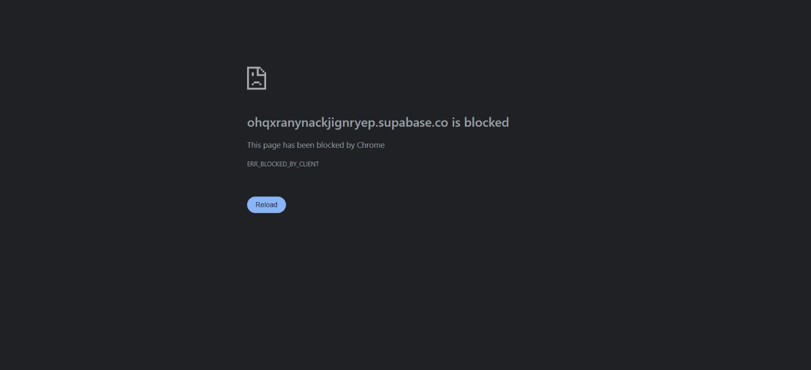

# Loop371 — tarjeta test y retorno

### Loop371 — Auth y Checkout reales para Agregar tarjeta, 3/10/2026

Referencia remota a3c969cd9103fd46dc5cd886999912526ce75efb reconsultada sin cambios. Fixture desechable Auth confirmada en DEV y customer Stripe test, sin cuenta humana: login real, consent/allowlist inválidos400, RPC privado403/42501, lista vacía antes de alta, mismo key devuelve la misma sesión pendiente. Checkout hosted completado por UI con Visa sintética4242; SetupIntent succeeded/off_session, sesión setup/test sin payment_intent ni subscription. Endpoint real devuelve saved/card_id y ownstate coincide; methods una tarjeta4242, defaultfalse y siete campos minimizados. Replay saved idéntico. Gate acceptance verify exit0/b2c4f0 5.46s; charges/PaymentIntents/invoices/subscriptions0.

Chrome volvió a payment-return pero mostró ERR_BLOCKED_BY_CLIENT; PNG checkout-return-blocked conserva evidencia. GET independiente200/textplain/no-store y CSP sandbox no demuestra retorno visible correcto ni identifica la causa. No se desactivaron protecciones/extensiones. Corregir/investigar retorno antes de cerrar recorrido; alta server integrada probada, no aceptación instalada.

Limpieza Stripe verificada deletedtrue (cleanup exit0/869d9f), SQL propia protegida por UUID/email/job/key y ausencia de filas financieras: Auth/identidades/sesiones/refresh_tokens/jobs/wallet0. Profiles no cascada desde auth.users: se observó1 y eliminó explícitamente sólo UUID fixture; comprobación final0. Journal externo limpio, contraseña retirada; ningún secreto/captura con tarjeta real comprometido. No producción/flags/cobros/CM/push. Objetivo completo sigue pendiente: retorno, default/remove sin Guardian, billeteras, apoyos con tarjetas y matriz/aceptación global.

