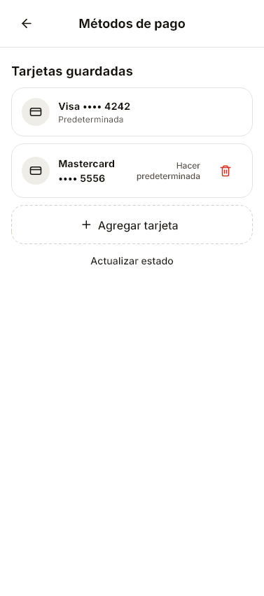
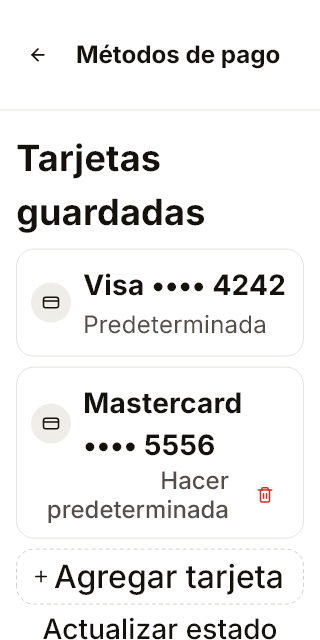

# Loop374 — Métodos de pago

### Loop374 — composición de tarjetas contra Source, 3/10/2026

Previo373 progreso45de3ab. Referencia a3c969cd9103fd46dc5cd886999912526ce75efb reconsultada; CSS content-pad20/16/32 y list-stackgap10, PaymentMethods sin enlaceGuardianextra. Cliente ajusta heading/filas/Agregar a10 y paddinginferior32; elimina enlace secundario Guardian sólo en Métodos, acceso real Perfil > Suscripción y pagos conservado. Actualizar estado aún extraSource; billeteras/default-remove sinGuardian/apoyo cardguardada pendientes, no pantalla completa declarada.

50/50guardian10s handle18944/exit0 despuésespacios antesquitarenlace. Capturador final filtro payment-methods-cards exit0/80981 6s; normal377x852 y320/text200% guardadasparity-loop374 y ambas inspeccionadas. Lista realwidget condatos sintéticos, íconos/acciones/consent/feedbackcapturados por filtro sinoverflow; no teléfono. Capturas muestran billeteras faltantes y Actualizar extra, no ocultar brechas. Analyze final limpio25.9s handle47417/exit0. Sin backend/flags/dinero/CM/push. Continúa objetivo completo.

